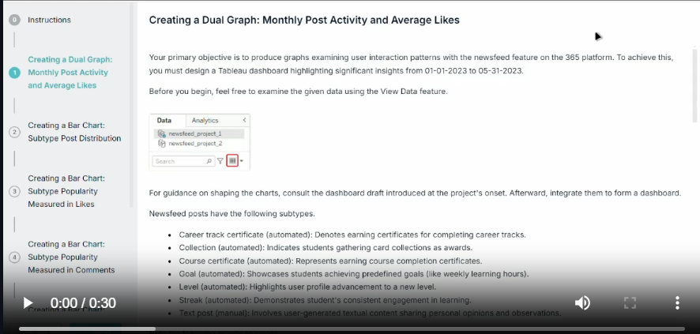
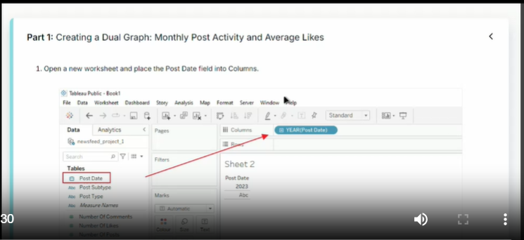

# Newsfeed Analytics Dashboard Documentation

## Project Overview
The Newsfeed Analytics Dashboard is a Tableau-based visualization project designed to analyze user interaction patterns with the newsfeed feature on the 365 platform. The dashboard covers data from January 1, 2023, to May 31, 2023, providing comprehensive insights into user engagement and content performance.

## Objectives
* Create a comprehensive dashboard for analyzing newsfeed engagement
* Visualize monthly post activity and average likes
* Analyze post subtype distribution and popularity
* Track user engagement through various metrics
* Document content distribution patterns across different subtypes

## Data Sources
* Primary data file: `newsfeed_project_1.csv`
* Secondary data file: `newsfeed_project_2.csv`
* Database: newsfeed_project_2 (for user engagement metrics)

## Post Subtypes
The newsfeed supports seven distinct post types:

1. Career track certificate (automated)
2. Collection (automated)
3. Course certificate (automated)
4. Goal (automated)
5. Level (automated)
6. Streak (automated)
7. Text post (manual)

## Dashboard Components

### 1. Dual Graph: Monthly Post Activity and Average Likes

#### Implementation Steps
1. Create new worksheet
2. Configure Post Date field:
   * Place in Columns
   * Format: Month-Year
   * Set to Discrete
3. Configure Number of Posts:
   * Place in Rows
   * Display as Bar chart
   * Enable mark labels
   * Set to Entire View
4. Calculate average likes:
   * Create calculated field: Avg Likes per Post
   * Formula: SUM(likes) / total posts
   * Add to Rows
   * Format to two decimal places
   * Display as Line chart
5. Merge using Dual Axis feature
6. Add filters:
   * Time range filter
   * Post subtype filter


### 2. Bar Charts Series

#### A. Subtype Post Distribution
##### Purpose
Create a horizontal bar chart visualizing post distribution across content subtypes.

##### Implementation Steps
1. Select subtype field for vertical axis
   * Drag to Rows shelf
2. Configure post count display
   * Add to Columns
3. Enable mark labels
   * Display precise values
   * Switch to Entire View
4. Sort in descending order
5. Title: "Subtype Post Distribution"

#### B. Subtype Popularity - Likes Analysis
##### Purpose
Analyze subtype popularity based on received likes.

##### Implementation Steps
1. Create new worksheet with subtype field
2. Add likes metrics to Columns
3. Enable data labels and Entire View
4. Sort in descending order
5. Title: "Subtype Popularity Measured in Likes"

#### C. Subtype Popularity - Comments Analysis
##### Purpose
Track engagement through comment metrics.

##### Implementation Steps
1. Place subtype field in Rows
2. Add comment count to Columns
3. Configure display settings
4. Sort in descending order
5. Title: "Subtype Popularity Measured in Comments"

### 3. Newsfeed User Engagement Chart
#### Metrics Tracked
* Visited Count (Newsfeed visitors)
* Active Users Count
* Liked Count
* Commented Count
* Posted Count

#### Implementation Steps
1. Connect to newsfeed_project_2 database
2. Create horizontal bar framework
3. Add all engagement metrics
4. Sort in descending order
5. Title: "Newsfeed User Engagement"

## Filtering Capabilities
### 1. Time Range Filter
* Enables period-specific analysis
* Affects all visualizations except user activity

### 2. Post Subtype Filter
* Allows content type filtering
* Supports multi-select functionality

## Technical Notes
```markdown
- Data source: Connect to `newsfeed_analysis.twbx`
- Create individual sheets before dashboard assembly
- Maintain consistent formatting
- Ensure proper filter configurations
- Use appropriate color coding
```

## Best Practices
1. Regularly refresh data sources
2. Validate calculated fields
3. Test filter functionality
4. Ensure proper date formatting
5. Maintain consistent labeling
6. Verify dual-axis alignment
7. Check mobile responsiveness

## Maintenance
```markdown
* Regular data updates recommended
* Monitor performance metrics
* Validate calculation accuracy
* Update filters as needed
* Backup dashboard configurations
```

## Future Enhancements
Consider adding:
* User segmentation analysis
* Engagement rate calculations
* Trend prediction capabilities
* Custom alert configurations
* Advanced filtering options
* Cross-referencing between metrics
* Time-based trend analysis
* Date range filtering capabilities
* Composite engagement scores

## Conclusion
The Newsfeed Analytics Dashboard provides a comprehensive view of:
* Content distribution patterns
* User engagement metrics
* Content type popularity
* Interaction trends
* Platform usage patterns

This tool enables data-driven decisions about content strategy and user engagement optimization.


### 3. Newsfeed User Engagement Chart - Final Results

#### Visualization Analysis
The horizontal bar chart reveals the following engagement hierarchy (in descending order):
1. Visited Count (highest engagement)
   * Shows the largest bar, indicating the highest number of users who viewed the newsfeed
2. Active Users Count
   * Significantly smaller than visit count, showing the conversion rate from visitors to active users
3. Liked Count
   * Similar to active users, suggesting most active users engage through likes
4. Commented Count
   * Notably smaller bar, indicating lower participation in commenting
5. Posted Count (lowest engagement)
   * Smallest bar, showing the lowest level of active content creation

#### Key Observations
* Significant drop-off between visitors and active users
* Higher preference for passive engagement (likes) over active participation (comments, posts)
* Clear engagement funnel pattern:
  - Viewing > Active Usage > Liking > Commenting > Posting

#### Implementation Details
1. Data Visualization
   * Type: Horizontal bar chart
   * Color Scheme: Blue gradient
   * Orientation: Descending order
   * Labels: Clear value display for each metric

2. Technical Setup
   * Database: newsfeed_project_2
   * Chart Type: Horizontal bars
   * View Mode: Entire View
   * Label Display: Enabled for precise values

3. Metrics Tracked
   * Visited Count: Total newsfeed visitors
   * Active Users Count: Users who interacted with content
   * Liked Count: Users who used the like feature
   * Commented Count: Users who left comments
   * Posted Count: Users who created original posts

#### Insights for Stakeholders
1. User Behavior Patterns
   * High viewership but lower active participation
   * Preference for simple engagement (likes) over content creation
   * Clear engagement pyramid structure

2. Areas for Improvement
   * Bridge gap between visitors and active users
   * Encourage more content creation
   * Increase comment participation
   * Convert passive viewers to active participants

3. Success Metrics
   * Monitor changes in engagement ratios
   * Track conversion rates between levels
   * Measure growth in active participation

This final visualization completes the dashboard by providing a clear overview of user engagement patterns, helping stakeholders understand user behavior and identify areas for improvement in the platform's engagement strategy.


## Instruction Video
The **Instruction Video** provides a detailed walkthrough of the task, outlining the objectives, steps, and key points necessary for understanding the problem. It serves as a guide to help viewers approach the solution systematically.

[](./videos/instruction.mp4)

---

## Solution Video
The **Solution Video** demonstrates the complete resolution of the task presented in the Instruction Video. It includes step-by-step explanations, highlighting critical aspects of the implementation or reasoning.

[](./videos/Solution.mp4)